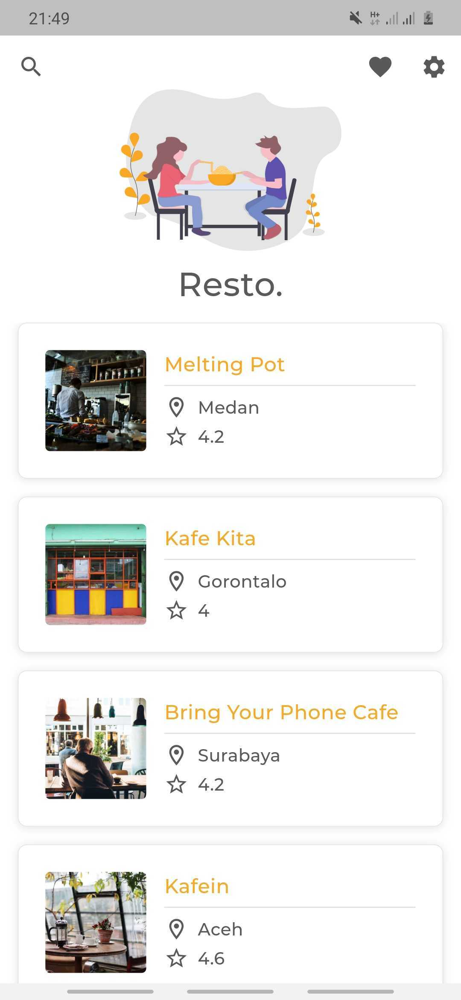
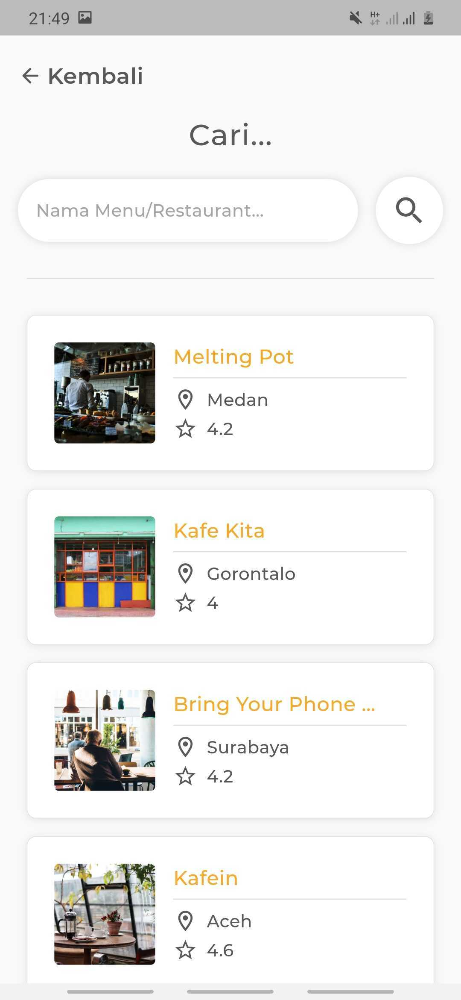
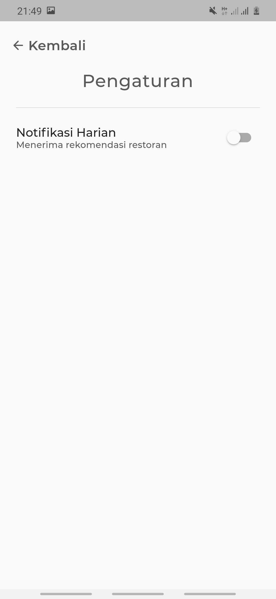
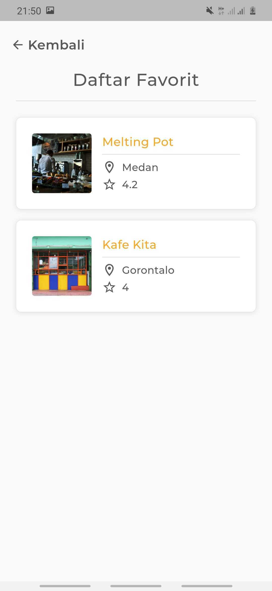
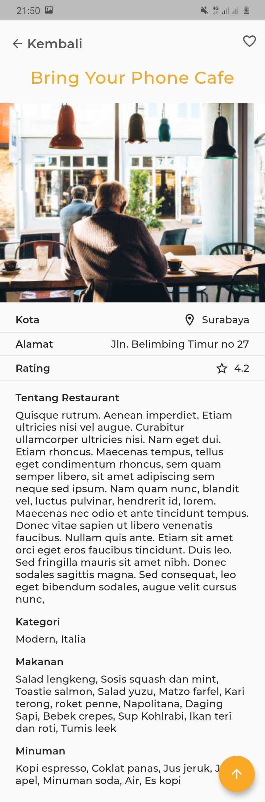

# restaurant_app

Restaurant App made with flutter.
Implementing :
- [Bloc](https://bloclibrary.dev/)
- [Http Request with Dio](https://pub.dev/packages/dio)
- [Local data & caching with Hydrated Bloc](https://pub.dev/packages/hydrated_bloc)
- [Hero Animation](https://flutter.dev/docs/development/ui/animations/hero-animations)
- [SliverList and SliverAppBar](https://flutter.dev/docs/development/ui/advanced/slivers)
- Local Notification
- etc.

## Screenshots

        

## Instalation

Install dependencies

```
flutter pub get
```

Run the app

```
flutter run
```
